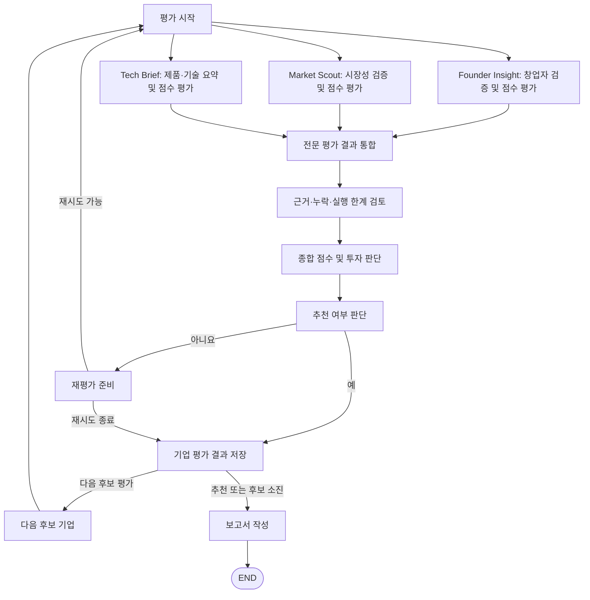

# AI Energy Startup Investment Evaluation Agent

본 프로젝트는 AI Agent를 활용하여 에너지 스타트업의 투자 검토 적합성을 분석하는 실습 프로젝트입니다. 창업자·팀 역량, 시장성, 제품·기술 정보를 각 전문 Agent가 조사하고 점수화한 뒤, 평가 결과를 통합하여 투자 판단과 보고서를 생성하도록 설계합니다.

## Overview

### 설계 목표

- **Objective**: 에너지 스타트업의 창업자·팀 역량, 시장 규모·성장 가능성, 실제 고객 수요, 제품·기술 정보의 구체성과 명확성을 기준으로 투자 검토 적합성 분석
- **Method**: LangGraph 기반 Multi-Agent Workflow, Agentic RAG, 웹 검색, 계산 Tool, 구조화된 State를 활용한 결과 통합
- **Output**: 출처와 평가 점수, 최종 판단을 포함하는 기업 평가 보고서

## Features

- **PDF 기반 정보 추출**: 에너지 시장·정책 보고서, 기술백서, 논문, 실증자료에서 필요한 근거 검색
- **웹 기반 기업 조사**: 기업 홈페이지, 인터뷰, 투자 기사 등을 활용한 기업·창업자 정보 수집 및 교차검증
- **전문 Agent별 평가**: 각 Agent가 담당 항목의 근거를 정리하고 점수와 산정 이유 반환
- **근거 검토와 잠정 평가**: 확보한 자료와 누락·실행 오류를 함께 기록하고, 자료가 부족해도 잠정 점수를 산정
- **조건부 재평가**: 종합 투자 판단이 추천에 이르지 못하면 설정된 횟수만큼 재평가하고 다음 후보를 탐색
- **State 기반 처리**: 기업 정보, 전문 평가 결과, 점수, 분기 상태, 오류 기록 공유
- **보고서 생성**: 평가 결과를 PDF로 저장하고 본문에 사용한 출처를 REFERENCE에 수록

## Tech Stack

| 구분 | 기술 및 설정 |
|---|---|
| Language | Python |
| Framework | LangGraph |
| LLM / Generator | OpenAI `gpt-4o-mini`(창업자·시장), `gpt-4o`(기술·보고서). 모델명은 `.env`에서 변경 가능 |
| LLM / Judge | OpenAI `gpt-4o`(종합 투자 판단, `INVESTMENT_MODEL`) |
| Retrieval | 로컬 FAISS(시장·기술 PDF), 시장 RAG의 BM25 결합 검색. Hit@3·MRR@10은 아직 측정하지 않음 |
| Embedding | `intfloat/multilingual-e5-small` |
| Web Search | Tavily Search API |
| PDF Processing | PyMuPDF, LangChain `PyMuPDFLoader` |
| Calculation | Python 점수 합산 및 시장 성장률·CAGR 계산 함수 |
| State Schema | TypedDict, Annotated, Pydantic 기반 출력 검증 |

## Agents

| Agent | 모듈 파일명 | 역할 | 활용 방식 | 담당 배점 |
|---|---|---|---|---:|
| **Founder Insight** | `agents/founder_insight.py` | 창업자·핵심 팀의 경력과 전문성 평가 | Tavily 웹 검색 | 25 |
| **Market Scout** | `agents/market_scout.py` | 시장 규모·성장 가능성과 실제 고객 수요 평가 | 시장 RAG, Tavily 웹 검색, 성장률 계산 | 50 |
| **Tech Brief** | `agents/tech_brief.py` | 제품·기술 정보의 구체성과 차별성 평가 | 기술 RAG, Tavily 웹 검색 | 25 |
| **Investment Evaluator** | `agents/investment_evaluator.py` | 항목 점수와 근거를 참고해 종합 점수 및 추천 여부 판단 | 통합 State, LLM | 종합 100 |
| **Report Generator** | `agents/report_generator.py` | 평가 결과를 SUMMARY·본문·REFERENCE로 작성하고 PDF 저장 | 통합 State, LLM | — |

세 전문 평가 Agent는 담당 항목별 점수, 산정 이유, 근거와 출처, 추가 확인사항을 반환합니다. investment_evaluator는 이를 종합해 최종 판단을 생성하고, report_generator는 평가 결과를 보고서로 작성합니다. Tech Brief는 제품·기술 요약과 함께 정보의 구체성 및 명확성을 평가합니다. 이 점수는 기술 타당성이나 실제 성능을 독립적으로 검증한 결과를 의미하지 않습니다.

## Architecture



세 전문 Agent의 결과가 모두 준비되면 통합 Node가 근거·누락 정보·실행 한계를 정리합니다. 근거가 부족해도 종합 투자 평가로 전달하며, 잠정 점수와 한계를 함께 반영합니다. 추천 여부와 종합 점수는 `investment_evaluator`가 항목 점수를 기준으로 판단합니다.

현재 `.env`의 `MAX_RETRIES=1`에 따라 기업별 재평가는 한 번 수행합니다. 추천 기업이 나오면 `STOP_ON_FIRST_RECOMMENDATION=true` 설정에 따라 바로 보고서를 작성합니다. 추천 기업 없이 후보 탐색이 끝나도 확보한 평가 결과로 보고서를 작성합니다.

### Report Structure

| 장 제목 | 포함 내용 |
|---|---|
| SUMMARY | 핵심 사업, 시장 기회, 제품·기술 특징, 팀 역량, 최종 판단 요약 |
| 1. 사업 개요 | 기업·제품, 해결하려는 문제, 핵심 고객과 사업 내용 |
| 2. 시장성 및 성장 가능성 | 목표시장, 성장 가능성, 실제 고객 수요와 영업 장벽 |
| 3. 제품·기술 및 팀 역량 | 기술 작동 원리, 차별성·성능 정보, 창업자와 팀 역량 |
| 4. 종합 평가 및 투자 판단 | 항목별 점수, 종합 점수, 판단 이유와 추가 확인사항 |
| REFERENCE | 보고서 작성에 사용한 자료의 제목·페이지·URL |

보고서는 전문 Agent 결과 통합 → 근거 검토 → 항목 점수 기반 종합 판단 → SUMMARY 작성 → 본문 작성 → 사용 출처 정리 순서로 구성합니다.

## Directory Structure

```text
skala-rag/
├── app.py                         # 실행 및 RAG 인덱스 초기화
├── requirements.txt               # 전체 Python 의존성
├── README.md
├── .env example                   # 환경변수 예시
├── .env                           # 로컬 설정값 (Git 제외)
├── .gitignore
├── agents/
│   ├── evaluation_support.py
│   ├── founder_insight.py
│   ├── investment_evaluator.py
│   ├── market_scout.py
│   ├── report_generator.py
│   └── tech_brief.py
├── graph/
│   ├── graph.py                    # Node·Edge 및 분기
│   └── state.py                    # 공유 State
├── prompts/
│   ├── founder_insight_prompt.py
│   ├── investment_evaluator_prompt.py
│   ├── market_scout_prompt.py
│   ├── report_generator_prompt.py
│   └── tech_brief_prompt.py
├── data/
│   ├── market/시장성_종합자료2.pdf
│   └── tech/tech-10-startups-50pages-2026-09-30.pdf
└── rag/
    ├── __init__.py
    ├── market_scout.py            # 시장 PDF 검색
    ├── market_index/              # 시장 FAISS 인덱스
    ├── product_tech_retriever.py  # 기업별 기술 검색 연결
    ├── tech_embeddings.py         # 로컬 E5 임베딩
    ├── tech_ingest.py             # 기술 PDF 인덱스 구축
    ├── tech_search.py             # 기술 FAISS 검색
    └── vector_index_product/      # 기업별 기술 FAISS 인덱스
```

`.venv/`, `.cache/`, `__pycache__/`는 로컬 실행 중 생성되는 폴더입니다. 보고서 생성 시 `outputs/investment_report.pdf`가 만들어집니다.

## 실행 방법

Python 3.10 이상에서 `.env example`을 참고해 저장소 루트의 `.env`에 API 키와 모델 설정을 입력합니다. PDF 원본은 `data/market/`, `data/tech/`에 두며, `app.py`가 누락된 RAG 인덱스를 실행 시 구축합니다.

macOS / Linux:

```sh
python3 -m venv .venv
source .venv/bin/activate
python -m pip install -r requirements.txt
python app.py
python app.py --trace  # LangSmith 추적 사용
```

Windows PowerShell:

```powershell
py -3 -m venv .venv
.venv\Scripts\Activate.ps1
python -m pip install -r requirements.txt
python app.py
python app.py --trace
```

LangSmith 추적 기본값은 `.env`의 `LANGSMITH_TRACING`을 따릅니다. 실행 결과는 터미널에 출력되며 PDF는 `outputs/investment_report.pdf`에 저장됩니다.

## Contributors

| 이름 | 담당 | 역할 |
|---|---|---|
| 강서현 | Prompt | Agent별 Prompt 템플릿 작성 |
| 김가은 | Agent | 종합 투자 판단, 보고서 작성, 제품 기술 요약 |
| 김태완 | Graph | State·Node·Edge 설계, Agent 연동, 평가 결과 검증·통합, 조건부 분기 및 재시도 흐름 구현 |
| 심지용 | RAG | 시장성 검증 Agent에 필요한 RAG 설계 |
| 엄진용 | Agent | 창업자 검증, 시장성 검증 |
| 유선일 | RAG | 제품.기술 요약 Agent에 필요한 RAG 설계 |
