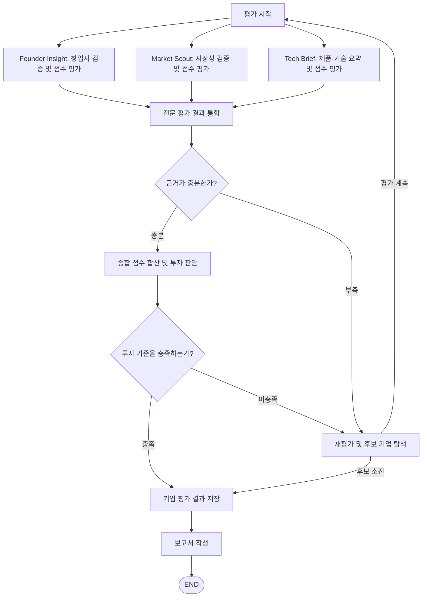

# AI Energy Startup Investment Evaluation Agent

본 프로젝트는 AI Agent를 활용하여 에너지 스타트업의 투자 검토 적합성을 분석하는 실습 프로젝트입니다. 창업자·팀 역량, 시장성, 제품·기술 정보를 각 전문 Agent가 조사하고 점수화한 뒤, 평가 결과를 통합하여 투자 판단과 보고서를 생성하도록 설계합니다.

## Overview

제품·기술 요약 Agent는 `agents/tech_brief.py`의 `ProductTechAgent`로 구현되어 있습니다. 실제 Retriever와 모델은 외부에서 주입하며, 공통 결과를 반환합니다. 호출 방법·어댑터 교체 위치·Mock 검증 범위는 [제품·기술 Agent 연동 안내](tests/README.md#제품기술-요약-agent)를 참고하세요.

### 종합 투자 판단·보고서 Agent 실행

Python 3.10 이상이 필요합니다. Pydantic과 실제 모델 연결에 필요한 패키지는 `requirements-agent.txt`로 설치합니다. Mock 실행에는 API 키가 필요하지 않습니다.

처음 받는 경우:

```sh
git clone --branch agent https://github.com/yu4923/skala-rag.git
cd skala-rag
python3 -m pip install -r requirements-agent.txt
python3 demo_agents.py
```

이미 저장소가 있다면 로컬 작업을 커밋하거나 보관한 뒤 `git switch agent`, `git pull --no-rebase origin agent`로 갱신하고 실행합니다. Windows에서는 `python3` 대신 `py -3`를 사용할 수 있습니다.

```sh
# 자료 부족 시나리오 실행
python3 demo_agents.py --needs-more-information

# 단위 테스트 실행
python3 -m unittest discover -s tests -v
```

실행 결과는 터미널에 JSON으로 출력됩니다. 기본 Mock은 총점 `100.0`, 판단 `pending`이며, 자료 부족 Mock은 총점 `null`, 판단 `additional_research`입니다. 두 경우 모두 실제 기업 평가가 아닙니다. 현재 실행 범위는 전문 Agent의 Mock 결과를 받아 종합 판단과 템플릿 보고서를 생성하는 단계이며, LLM·웹 검색·RAG·전체 Graph는 실행하지 않습니다.

`agents/`와 `prompts/`를 포함한 저장소 전체를 받아야 합니다. 공통 보조 코드는 `agents/evaluation_support.py`, 보고서 프롬프트는 `prompts/report_generator_prompt.py`에 있습니다. 다른 프로젝트에서 호출하는 방법과 미연결 항목은 [연동 안내](tests/README.md)를 참고하세요.

### 실제 LLM 연결

저장소 루트의 `.env`는 사용자가 생성합니다. 다음 두 값을 넣으세요. 모델명은 사용 가능한 팀 모델명으로 지정하며 코드가 임의로 선택하지 않습니다.

```dotenv
OPENAI_API_KEY=발급받은_API_키
LLM_MODEL=팀에서_정한_모델명
```

앞서 안내한 `OPENAI_MODEL`도 `LLM_MODEL`의 대체 이름으로 지원합니다. 두 값이 다르면 오류가 나므로 하나만 사용하세요. `OPENAI_API_KEY`를 환경변수로 전달하는 방식은 [OpenAI 공식 안내](https://developers.openai.com/api/docs/quickstart)를 따릅니다. `.env`는 Git 추적 대상이 아닙니다.

```sh
python3 -m pip install -r requirements-agent.txt
python3 demo_agents.py --check-config
# 실제 LLM 두 번 호출: API 비용 발생, 기업 입력은 여전히 Mock
python3 demo_agents.py --llm
```

`--check-config`는 설정을 읽고 모델을 생성하지만 API를 호출하지 않으므로 키 유효성·모델 접근 권한까지 확인하는 명령은 아닙니다. `--llm`은 종합 투자 판단과 보고서 Agent를 실제 호출합니다. 옵션 없이 실행하면 기존 오프라인 Mock입니다.

제품·기술/종합 판단/보고서 모듈의 `run()`은 기본 모델이 주입되지 않으면 `.env` 모델을 생성합니다. 파일 상단 `MODEL_SETTINGS`에서 제한 시간·재시도 횟수와 선택 모델명/온도를 변경할 수 있습니다. 제품·기술 검색용 Retriever 및 전체 Graph의 `review_evidence()` 연결은 여전히 별도 작업입니다.

### 설계 목표

- **Objective**: 에너지 스타트업의 창업자·팀 역량, 시장 규모·성장 가능성, 실제 고객 수요, 제품·기술 정보의 구체성과 명확성을 기준으로 투자 검토 적합성 분석
- **Method**: LangGraph 기반 Multi-Agent Workflow, Agentic RAG, 웹 검색, 계산 Tool, 구조화된 State를 활용한 결과 통합
- **Output**: 출처와 평가 점수, 최종 판단을 포함하는 기업 평가 보고서

## Features

- **PDF 기반 정보 추출**: 에너지 시장·정책 보고서, 기술백서, 논문, 실증자료에서 필요한 근거 검색
- **웹 기반 기업 조사**: 기업 홈페이지, 인터뷰, 투자 기사 등을 활용한 기업·창업자 정보 수집 및 교차검증
- **전문 Agent별 평가**: 각 Agent가 담당 항목의 근거를 정리하고 점수와 산정 이유 반환
- **근거 충분성 판단**: 필수 정보 누락, 주장과 근거의 관련성, 자료 간 모순 및 추가 확인사항 검토
- **조건부 재평가**: 근거 부족 또는 투자 기준 미충족 시 재평가 및 후보 기업 탐색
- **State 기반 처리**: 기업 정보, 전문 평가 결과, 점수, 분기 상태, 오류 기록 공유
- **보고서 생성**: 실제 본문에 사용한 출처만 REFERENCE에 수록

## Tech Stack

| 구분 | 기술 및 설정 |
|---|---|
| Language | Python |
| Framework | LangGraph |
| LLM / Generator | {GPT version} |
| LLM / Judge | {GPT version} |
| Retrieval | {VectorDB} — Hit@3: {측정값}, MRR@10: {측정값} |
| Embedding | `intfloat/multilingual-e5-small` |
| Web Search | {웹 검색 Tool 또는 API} |
| PDF Processing | {PDF 로더 및 텍스트 추출 라이브러리} |
| Calculation | {계산 Tool} |
| State Schema | TypedDict, Annotated, Pydantic 기반 출력 검증 |

## Agents

| Agent | 모듈 파일명 | 역할 | 활용 방식 | 담당 배점 |
|---|---|---|---|---:|
| **Founder Insight** | `founder_insight_agents.py` | 창업자·핵심 팀의 경력, 에너지 분야 전문성, 과거 창업·사업화 경험을 조사하고 역량 평가 | 웹 검색 및 교차검증 | 25 |
| **Market Scout** | `market_scout_agents.py` | 시장 규모·성장 가능성과 PoC·유료 고객·장기계약 등 실제 고객 수요 평가 | RAG, 웹 검색, 계산 Tool | 50 |
| **Tech Brief** | `tech_brief_agents.py` | 주요 제품, 기술 작동 원리, 적용 분야, 차별성, 공개된 성능·비용 정보를 요약하고 담당 항목의 점수 산정 | RAG, 웹 검색 | 25 |
| **investment_evaluator** | `investment_evaluator_agents.py` | 전문 Agent의 평가 결과와 근거를 검토하고 점수를 합산하여 최종 투자 판단 도출 | 통합 State, LLM 기반 판단, 점수 합산 로직 | 종합 100 |
| **report_generator** | `report_generator_agents.py` | 전문 평가 결과와 최종 판단을 바탕으로 SUMMARY·본문·REFERENCE 작성 | 통합 State, LLM 기반 보고서 생성 | — |

세 전문 평가 Agent는 담당 항목별 점수, 산정 이유, 근거와 출처, 추가 확인사항을 반환합니다. investment_evaluator는 이를 종합해 최종 판단을 생성하고, report_generator는 평가 결과를 보고서로 작성합니다. Tech Brief는 제품·기술 요약과 함께 정보의 구체성 및 명확성을 평가합니다. 이 점수는 기술 타당성이나 실제 성능을 독립적으로 검증한 결과를 의미하지 않습니다.

## Architecture



세 전문 Agent의 결과가 모두 준비되면 통합 Node를 실행합니다. 통합 단계는 핵심 근거의 중복을 제거하고, 필수 정보와 자료의 관련성·모순을 검토하여 근거 충분 여부를 결정합니다.

기업별 재평가는 최대 1회로 설정합니다. 다른 기업으로 이동하기 전 현재 기업의 결과를 보관하고, 기업이 바뀌면 재시도 횟수와 현재 평가 결과를 초기화합니다. 후보 탐색이 종료되면 추천 여부와 관계없이 확보한 결과로 보고서를 작성합니다.

### Report Structure

| 페이지 | 장 제목 | 포함 내용 |
|---|---|---|
| 1 | SUMMARY | 핵심 사업, 시장 기회, 제품·기술 특징, 팀 역량, 최종 판단을 반 페이지 이내로 요약 |
| 1 | 1. 사업 개요 | 기업·제품 소개, 해결하려는 에너지 문제, 핵심 고객, 수익 구조 |
| 2 | 2. 시장성 및 성장 가능성 | 목표시장, 규모·성장률, 고객 수요, PoC·유료 고객·장기계약, 영업·설치 장벽 |
| 3 | 3. 제품·기술 및 팀 역량 | 기술 작동 원리, 공개된 차별성·성능·비용 정보, 창업자와 핵심 팀의 전문성 |
| 4 | 4. 종합 평가 및 투자 판단 요약 | 전문 평가의 핵심 내용, 추가 확인사항, 항목별 점수, 종합 점수와 최종 판단 |
| 5 | REFERENCE | 실제 본문 작성에 사용한 자료만 기재 |

보고서는 전문 Agent 결과 통합 → 근거 검토 → 점수 합산 및 최종 판단 → SUMMARY 작성 → 본문 작성 → 사용 출처 정리 순서로 구성합니다.

## Directory Structure

```text
├── data/                  # 문서 풀
├── agents/                # 평가 기준별 Agent 모듈
├── prompts/               # 프롬프트 템플릿
├── outputs/               # 평가 결과 저장
├── state.py               # 공유 State 및 데이터 타입
├── graph.py               # 평가 설정, 노드 함수 및 그래프 연결
├── app.py                 # 실행 함수
└── README.md
```

## Contributors 
강서현
김가은
김태완
심지용
엄진용
유선일
